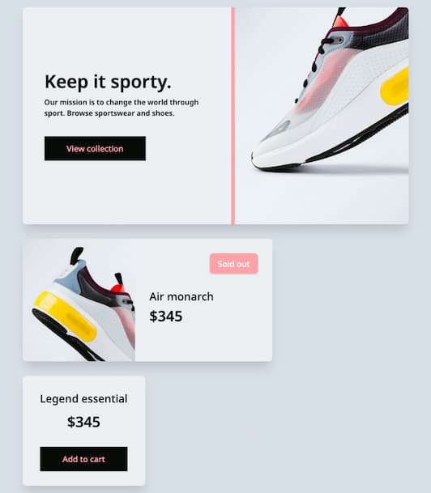
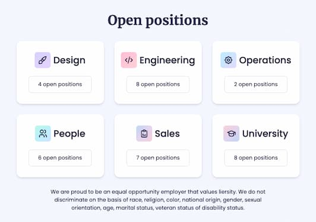
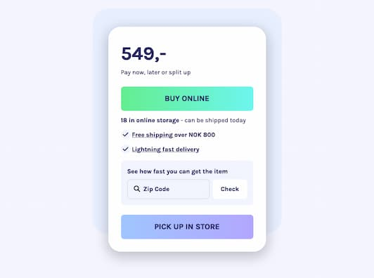
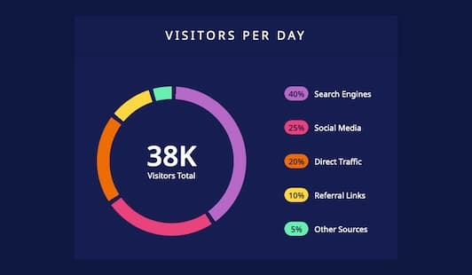
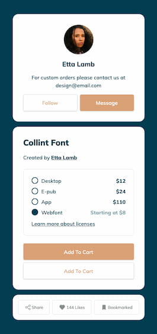

# I Code This - Daily Challenges

This is a growing collection of challenges solved for the platform [I Code This](https://iCodeThis.com/?ref=Katrien), part 2. I Code This posts daily web development challenges.

## Table of contents

- [Intro](#intro)
- [Challenges](#challenges)
- [Useful Resources](#usefulresources)
- [Author](#author)

## Intro

All the solutions are deployed on Github using Github Pages. You'll find the links here in ascending order (latest exercise on top).
Unless noted otherwise, the building of the exercises is done with:

- Semantic HTML5 markup
- CSS custom properties
- Flexbox
- CSS Grid
- Mobile-first workflow
- Vanilla JS

## Challenges

### Challenge 114

- [Code URL](https://github.com/graficdoctor/i-code-this-daily-challenges-02/tree/main/114-statistics-website)
- [Live URL](https://graficdoctor.github.io/i-code-this-daily-challenges-02/114-statistics-website)

---

### Challenge 113

- [Code URL](https://github.com/graficdoctor/i-code-this-daily-challenges-02/tree/main/113-sport-webshop)
- [Live URL](https://graficdoctor.github.io/i-code-this-daily-challenges-02/113-sport-webshop)

---

### Challenge 112

- [Code URL](https://github.com/graficdoctor/i-code-this-daily-challenges-02/tree/main/112-job-board)
- [Live URL](https://graficdoctor.github.io/i-code-this-daily-challenges-02/112-job-board)

---

### Challenge 111

- [Code URL](https://github.com/graficdoctor/i-code-this-daily-challenges-02/tree/main/111-one-time-pricing)
- [Live URL](https://graficdoctor.github.io/i-code-this-daily-challenges-02/111-one-time-pricing)

---

### Challenge 110

- [Code URL](https://github.com/graficdoctor/i-code-this-daily-challenges-02/tree/main/110-analytics-graph)
- [Live URL](https://graficdoctor.github.io/i-code-this-daily-challenges-02/110-analytics-graph)

---

### Challenge 109

- [Code URL](https://github.com/graficdoctor/i-code-this-daily-challenges-02/tree/main/109-20s-profile)
- [Live URL](https://graficdoctor.github.io/i-code-this-daily-challenges-02/109-20s-profile)

---

### Challenge 108

- [Code URL](https://github.com/graficdoctor/i-code-this-daily-challenges-02/tree/main/108-testimonials)
- [Live URL](https://graficdoctor.github.io/i-code-this-daily-challenges-02/108-testimonials)

---

### Challenge 107

- [Code URL](https://github.com/graficdoctor/i-code-this-daily-challenges-02/tree/main/107-social-invite)
- [Live URL](https://graficdoctor.github.io/i-code-this-daily-challenges-02/107-social-invite)

**Useful Resources**

- [How To - Custom Checkbox](https://www.w3schools.com/howto/howto_css_custom_checkbox.asp)

---

### Challenge 106

- [Code URL](https://github.com/graficdoctor/i-code-this-daily-challenges-02/tree/main/106-select-account)
- [Live URL](https://graficdoctor.github.io/i-code-this-daily-challenges-02/106-select-account)

---

### Challenge 105

- [Code URL](https://github.com/graficdoctor/i-code-this-daily-challenges-02/tree/main/105-product-comps)
- [Live URL](https://graficdoctor.github.io/i-code-this-daily-challenges-02/105-product-comps)

---

### Challenge 104

- [Code URL](https://github.com/graficdoctor/i-code-this-daily-challenges-02/tree/main/104-blog-ui)
- [Live URL](https://graficdoctor.github.io/i-code-this-daily-challenges-02/104-blog-ui)

---

### Challenge 103

- [Code URL](https://github.com/graficdoctor/i-code-this-daily-challenges-02/tree/main/103-grid-footer)
- [Live URL](https://graficdoctor.github.io/i-code-this-daily-challenges-02/103-grid-footer)

---

### Challenge 102

- [Code URL](https://github.com/graficdoctor/i-code-this-daily-challenges-02/tree/main/102-blog-page)
- [Live URL](https://graficdoctor.github.io/i-code-this-daily-challenges-02/102-blog-page)

---

### Challenge 101

- [Code URL](https://github.com/graficdoctor/i-code-this-daily-challenges-02/tree/main/101-available-positions)
- [Live URL](https://graficdoctor.github.io/i-code-this-daily-challenges-02/101-available-positions)

---

## Author

- Website - [Katrien S](https://www.katriens.be)
- Twitter - [@graficdoctor](https://www.twitter.com/graficdoctor)
